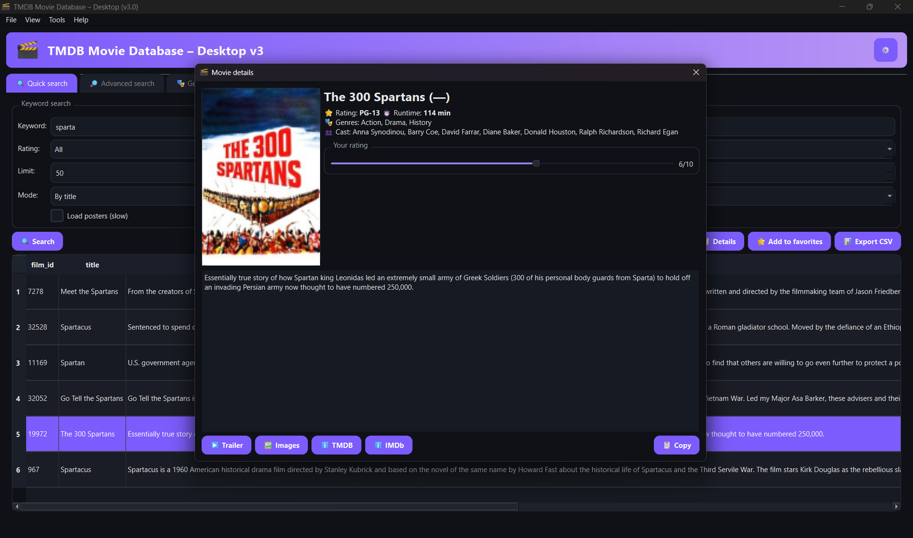
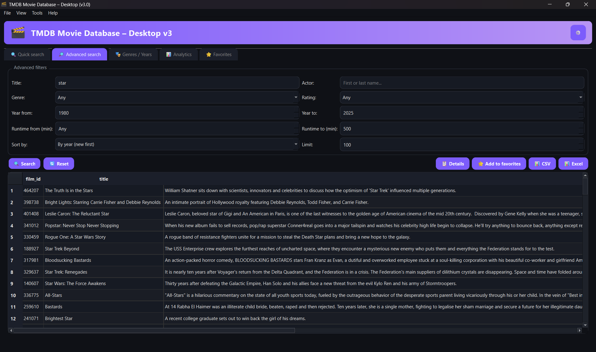

TMDB Movie Database — Desktop v3

  
 
      

A desktop client for exploring a local movies database with quick/advanced search, analytics, favorites and a clean dark UI.
Uses MySQL for primary data and MongoDB for app logs. Posters are loaded via TMDB API.

Table of contents

Features

Tech stack

Screenshots

Project layout

Getting started

Configuration

Keyboard shortcuts

Data & logging

Roadmap

License

✨ Features

Quick & Advanced search: title/actor/mode toggles, rating/year/runtime filters, preset sort

Genres / Years tab for targeted discovery

Analytics: distribution by year, top genres, ratings histogram, average runtime by genre

Favorites with tags & notes, CSV/Excel export

Movie details modal with poster, rating, genres, cast + shortcuts (Trailer, TMDB, IMDb)

Settings: TMDB API key, DB connection, cache control

Dark UI tuned for readability

🧱 Tech stack

Python 3.10+, PyQt6

MySQL as the primary store (your local DB, not Sakila)

MongoDB for logs and audit trail

Matplotlib for charts

Packaging/scripts in scripts/

🖼 Screenshots

Images live in screenshots/. If your filenames differ, adjust the paths below.

Search & Details
 

Genres / Years

Analytics

Favorites & Settings
 

About

🗂 Project layout
.
├─ scripts/                # helper scripts (import/export/seed, etc.)
├─ screenshots/            # images used in README and promo
├─ docs/                   # extra docs / diagrams (optional)
├─ main_gui3_en.py         # app entry (or your package entry point)
├─ requirements.txt
└─ README.md

🚀 Getting started
# 1) Create venv & install deps
python -m venv .venv
# Windows:
.venv\Scripts\activate
# macOS/Linux:
source .venv/bin/activate
pip install -r requirements.txt

# 2) Set environment (see .env example below)

# 3) Run the app
python main_gui3.py
# or, if packaged as a module:
# python -m tmdb_desktop

⚙️ Configuration

Create .env in the repo root:

# MySQL (primary data)
MYSQL_HOST=localhost
MYSQL_PORT=3306
MYSQL_DB=*******
MYSQL_USER=root
MYSQL_PASSWORD=your_password

# MongoDB (logs)
MONGO_URI=mongodb://localhost:27017
MONGO_DB=tmdb_desktop_logs

# External
TMDB_API_KEY=your_tmdb_key

# UI
APP_LANG=en

⌨️ Keyboard shortcuts

Ctrl+Enter run search, Ctrl+R reset filters

F5 refresh current tab, F11 fullscreen

Ctrl+E export CSV, Ctrl+Shift+E export Excel

Ctrl+, settings, Ctrl+Q exit

Double-click row → details; Right-click → context menu

📊 Data & logging

Primary DB: your local MySQL instance with movies, people, genres, links.

Logging: app events, errors and optional analytics snapshots go to MongoDB:

app_events — user actions (search, favorites ops)

errors — exceptions with context

analytics_snapshots — optional precomputed stats

🗺️ Roadmap

i18n dictionaries (EN default already)

Packaging for Windows (.exe)

More analytics (per-actor trends, decades)

Smarter poster caching & retries

Optional Docker setup for DBs

📜 License

Apache-2.0 — see LICENSE
.
